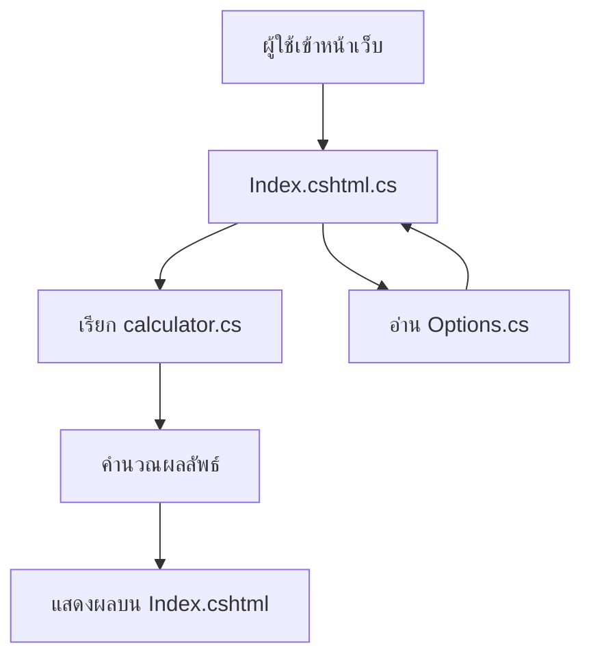

# Azure .NET ImgWeb Project

โปรเจกต์นี้เป็นเว็บแอปพลิเคชัน .NET สำหรับการคำนวณและแสดงผลผ่านหน้าเว็บ โดยมีโครงสร้างไฟล์หลักดังนี้:

## โครงสร้างโปรเจกต์
- `Program.cs` – จุดเริ่มต้นของโปรแกรม
- `Web.csproj` และ `Web.sln` – ไฟล์โปรเจกต์และโซลูชัน
- `calculator.cs` – ฟังก์ชันคำนวณ
- `Options.cs` – การตั้งค่าตัวเลือก
- `Pages/Index.cshtml` และ `Index.cshtml.cs` – หน้าเว็บหลัก

## Workflow
1. ผู้ใช้เข้าหน้าเว็บ (`Index.cshtml`)
2. หน้าเว็บเรียกใช้ฟังก์ชันจาก `calculator.cs` ผ่านโค้ดเบื้องหลัง (`Index.cshtml.cs`)
3. ผลลัพธ์แสดงบนหน้าเว็บ
4. การตั้งค่าต่าง ๆ ถูกจัดการผ่าน `Options.cs`
5. การทำงานทั้งหมดถูกควบคุมโดย `Program.cs`

## Workflow Chart

## วิธีการรันโปรเจกต์
1. ติดตั้ง .NET SDK
2. รันคำสั่ง `dotnet run` ในโฟลเดอร์โปรเจกต์
3. เปิดเบราว์เซอร์ไปยัง URL ที่แสดงในเทอร์มินัล

## License
MIT License
